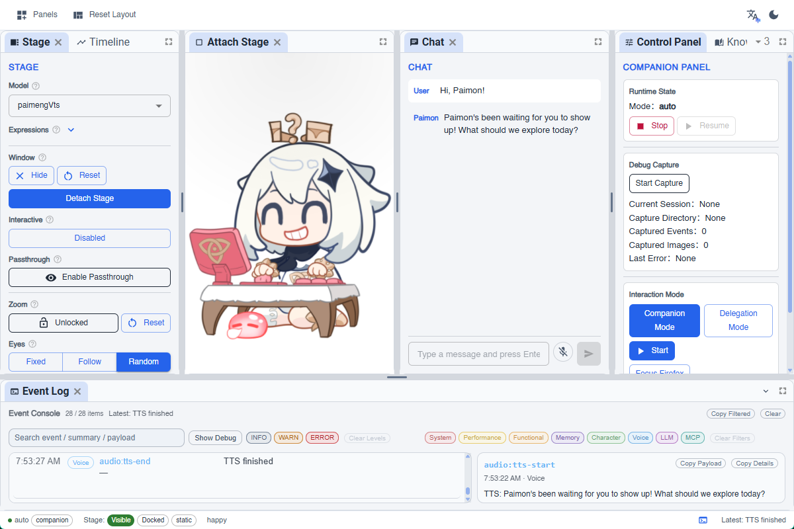

<h1 align="center">PAIMON</h1>

<p align="center">
  <strong>PAIMON the Attentive Interactive Multi-modal Observer-Navigator</strong>
</p>

<p align="center">
  一个将屏幕感知陪伴与有边界任务托管整合在同一应用运行时中的桌面 companion-agent 原型系统。
</p>

<p align="center">
  
  
  
</p>

<p align="center">
  
</p>

## 项目概览

`paimon-companion-tauri` 是 PAIMON 项目（FYP）的主实现仓库。它呈现的是一个建立在同一套技术基础之上、但分别激活的双路径桌面系统：

<p align="center">
  
</p>

- `Companion Mode`：强调屏幕感知存在感、语音交互、滚动记忆，以及与 Live2D 表达联动的 affect runtime
- `Delegation Mode`：通过有边界的多角色循环处理显式的浏览器与游戏任务

这个项目的整体方向仍然是“以陪伴为主”。委托执行能力被有意限制在明确任务、可验证、可收束的范围内，而不是追求无约束的自主操作。

## 当前包含的内容

- 基于 Tauri 的桌面宿主，以及 Rust 侧窗口、截图、聚焦与输入原语
- 基于 React 与 TypeScript 的 companion interaction、runtime orchestration 与可见 inspection surfaces
- 在同一套技术基础上分别激活的双模式交互设计
- 由 `Mission Analyst -> Operations Planner -> Progress Evaluator` 组成的三角色托管链路
- 面向保留验证任务的语义化处理，包括浏览器流程、`2048` 与 `Sokoban`
- 记忆、调试捕获、时间线检查与面向证据的运行时界面

## 系统方向

PAIMON 在一个运行时中结合了几条关键思路：

- 以 `GCC`（General Computer Control）实现基于屏幕的桌面交互
- 通过 MCP-facing 工具边界组织宿主控制与任务编排
- 在需要时结合本地观察与云端推理的混合感知策略

因此，这个仓库并不是某个单点功能的最小演示，而是 companion 行为、语音、Live2D 呈现、有边界托管、记忆与运行时检查界面在同一系统中的整合实现。

## 仓库结构

- `src/`：React UI 与 TypeScript 运行时
- `src-tauri/`：Rust / Tauri 后端与原生宿主边界
- `prompts/`：提示词与保留文案材料
- `docs/`：面向实现理解的项目文档
- `ROADMAP.md`：阶段历史与里程碑记录

你也会看到一些机器本地或分支相关的工作材料。这些是围绕项目存在的支持性工作界面，但不属于被跟踪主线实现的核心部分。

## 开发

前置环境：

- Node.js `20.19+` 或 `22.12+`（推荐 `22.x`）
  - 对应 Vite 7 的兼容性要求
- `pnpm 10+`
- Rust
- Windows 下的 Tauri 依赖环境

安装并启动：

```bash
pnpm install
pnpm dev
```

Rust 侧检查：

```bash
pnpm setup:local-asr
cargo check --manifest-path src-tauri/Cargo.toml
```

`pnpm dev` 会先执行仓库中保留的本地 ASR 准备步骤。关于本地运行时依赖边界、可选的 WSL 本地视觉服务脚本，以及保留的 GPT-SoVITS 路线，可参见 `docs/runtime-setup.md`。

## 边界说明

这个仓库的目标，是清晰呈现主实现本身，而不是保证所有机器本地运行条件、外部服务配置或评估 harness 都能一键复现。

这里最核心的 review surface，仍然是这个被跟踪的代码库，以及它所表达出来的运行时架构与系统边界。

## 延伸阅读

- `docs/architecture.md`：系统结构说明
- `docs/runtime-setup.md`：本地运行时依赖与可选 sidecar 服务说明
- `ROADMAP.md`：开发阶段与已接受里程碑记录
- `README.md`：英文版仓库首页
